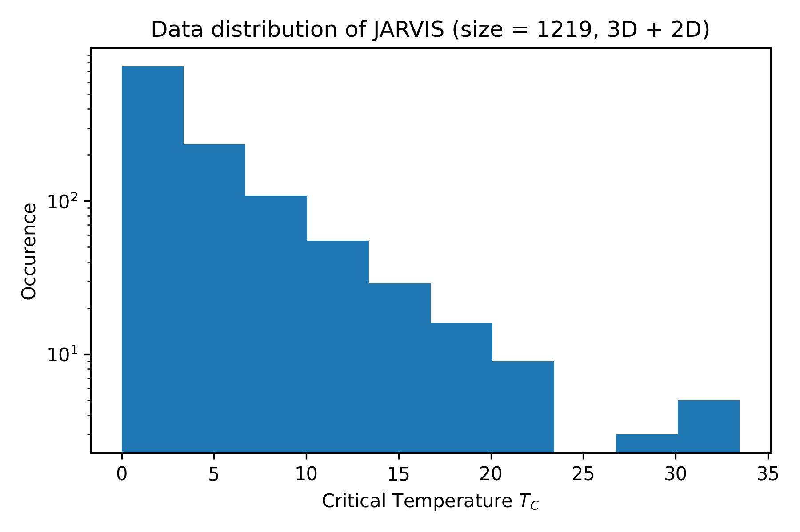

# Agent47-Material

## Tasks

- [x] Install PGCGM on cluster and get it up and running
- [ ] ~~Train PGCGM over JARVIS dataset~~
- [ ] Install GFlowNet on cluster and get it up and running
- [ ] Install GT4SD on cluster and get it up and running

## Goal

As compared to an [example work](https://pubs.acs.org/doi/10.1021/acs.jpclett.3c01260), we want to:

- Increase success rate
- Increase stability
- Increase physical realisticity and symmetry
- Multi-objective generation (e.g. functionality and stability)

The general idea is to replicate a work close to [MatterGen](https://arxiv.org/abs/2312.03687) (which is not open-sourced) and apply to superconductor discovery.

## Data

- JARVIS dataset is what we start with.

- SuperCon dataset is somehow hard to work with.

## Relevant code repositories

- **PGCGM** https://github.com/MilesZhao/PGCGM
    - Critic: it cannot do property-oriented inverse design. So the generated structures are more symmetric, but there is no way to insert TC information.
- **CDVAE** https://github.com/txie-93/cdvae
    - Critic: it does NOT enable imposing domain-based constraints into the generation process, and can lead to physically unrealistic and unstable structures.
- **ALIGNN** https://github.com/usnistgov/alignn
- **GflowNet** as in Crystal-GFN https://github.com/alexhernandezgarcia/gflownet
    - Critic: it lacks necessary docs and annotation to replicate the work
- **GT4SD** https://github.com/GT4SD/gt4sd-core **doc** https://gt4sd.github.io/gt4sd-core/#

## [Official References](https://ai4science.io/2024physics.html)

- **[JARVIS dataset](https://www.nature.com/articles/s41524-022-00933-1)** Designing high-TC superconductors with BCS-inspired screening, density functional theory, and deep-learning

- **[JARVIS dataset (2D version)](https://pubs.acs.org/doi/10.1021/acs.nanolett.2c04420)** High-Throughput DFT-Based Discovery of Next Generation Two-Dimensional (2D) Superconductors

- **[MatterGen](https://arxiv.org/abs/2312.03687)** **NOT open-source** MatterGen: a generative model for inorganic materials design

- **[CDVAE](https://arxiv.org/abs/2110.06197)** **Open-source** Crystal Diffusion Variational Autoencoder for Periodic Material Generation 

- **[Example workflow [CDVAE + ALIGNN]](https://pubs.acs.org/doi/10.1021/acs.jpclett.3c01260)** Inverse Design of Next-Generation Superconductors Using Data-Driven Deep Generative Models

- **[Crystal-GFN](https://arxiv.org/abs/2310.04925)** **Open-source** Crystal-GFN: sampling crystals with desirable properties and constraints

- **[ALIGNN (Materials property predictions)](https://www.nature.com/articles/s41524-021-00650-1)** **Open-source** Atomistic Line Graph Neural Network for improved materials property predictions

- **[SLICES](https://www.nature.com/articles/s41467-023-42870-7)** An invertible, invariant crystal representation for inverse design of solid-state materials using generative deep learning

## Other References

- **[DiffTransformer](https://arxiv.org/abs/2406.09263)** **NOT open-source** Generative Inverse Design of Crystal Structures via Diffusion Models with Transformers (ArXiv)

- **[DP-CDVAE](https://www.nature.com/articles/s41598-024-51400-4)** Diffusion probabilistic models enhance variational autoencoder for crystal structure generative modeling (Critic: it does not solve the challenge in CDVAE, only exploiting prediction accuracy)

- **[PGCGM](https://www.nature.com/articles/s41524-023-00987-9)** Physics guided deep learning for generative design of crystal materials with symmetry constraints (npj comp) Physics Guided Crystal Generative Model (PGCGM) (Critic: it potentially solves the problem to generate symmetric geometry)

- **[GT4SD](https://www.nature.com/articles/s41524-023-01028-1)** Accelerating material design with the generative toolkit for scientific discovery (npj comp)

- **[Constrained GAN](https://www.nature.com/articles/s41524-021-00526-4)** Constrained crystals deep convolutional generative adversarial network for the inverse design of crystal structures (npj comp) (Comment: PGCGM is more recent)

- **[CDVAE for 2D](https://www.nature.com/articles/s41524-022-00923-3)** Data-driven discovery of 2D materials by deep generative models (npj comp)

## Additional Datasets

- **[3DSC (Additional Crystal TC dataset)](https://www.nature.com/articles/s41597-023-02721-y)** 3DSC - a dataset of superconductors including crystal structures

- **[Kamal Choudhary figshare repo](https://figshare.com/authors/Kamal_Choudhary/4445539)** Many useful superconductor datasets