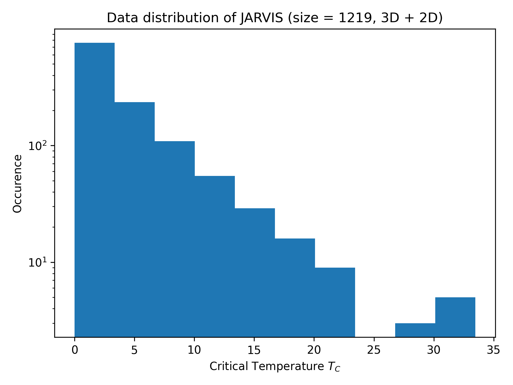

# Agent47-Material

A generative crystal material model for superconducter materials based on [FlowMM](https://github.com/facebookresearch/flowmm) by Facebook Research and [JARVIS Supercon Databse](https://figshare.com/articles/dataset/JARVIS-SuperconDB/21370572) by NIST.

This is a structured solution for the **[Materials Science Challenge](https://ai4science.io/2024physics.html) of [ai4science hackathon](https://ai4science.io/home.html)**, organized by [Shanghai AI Industry Association (上海市人工智能行业协会)](http://en.sh-aia.com/), [DeepVerse (幻量科技)](https://deepverse.tech/en/index.html), [Lightelligence 曦智科技](https://www.lightelligence.ai/), [SECCO 赛科](https://www.secco.com.cn/en_us), [Baidu AI Cloud (百度智能云)](https://intl.cloud.baidu.com/), [Nest.Bio Labs (巢生实验室)](https://www.nest.bio/).

## Results overview

See [presentation.pdf](presentation.pdf) for a full slide deck illustrating the background, relevant work, methodology, model training and validation, and unconditional generation results.

- [x] Data preprocessing (format conversion, split, etc.) for JARVIS 3D SuperCon Database
- [x] Deploy FlowMM with preprocessed data
- [x] FlowMM training with early-stopping monitoring validation loss
- [x] FlowMM validation with conditional generation - model achieved a Match Rate of 47.00% and an RMSE of 0.21
- [x] FlowMM de novo generation of crystals with the model lowest on validation loss - model generated 10K structures, achieved structural validity of 88.21%, composition validity of 68.43%
- [x] Structural pre-relaxation of generated crystals using [CHGNet](https://chgnet.lbl.gov/)
- [x] Lattice structure visulization, space group association of generated crystals
- [x] Energy above hull calculated for selected generated crystals

## Goal

As compared to an [example work](https://pubs.acs.org/doi/10.1021/acs.jpclett.3c01260), we want to:

- Increase success rate
- Increase stability
- Increase physical realisticity and symmetry
- Multi-objective generation (e.g. functionality and stability)

The general idea is to replicate a work close to [MatterGen](https://arxiv.org/abs/2312.03687) (which is not open-sourced) and apply to superconductor discovery.

## Data - [JARVIS Supercon Databse](https://figshare.com/articles/dataset/JARVIS-SuperconDB/21370572)

## Relevant code repositories

### Crystal Generation

- **AIRS** https://github.com/divelab/AIRS
    - Latest model "GMTNet" is not actually available
    - **SyMat** can be used
- **FlowMM** https://github.com/facebookresearch/flowmm
    - Issue with installing environment
- **PGCGM** https://github.com/MilesZhao/PGCGM
    - Critic: it cannot do property-oriented inverse design. So the generated structures are more symmetric, but there is no way to insert TC information
- **CDVAE** https://github.com/txie-93/cdvae
    - Critic: it does NOT enable imposing domain-based constraints into the generation process, and can lead to physically unrealistic and unstable structures
- **GflowNet** as in Crystal-GFN https://github.com/alexhernandezgarcia/gflownet
    - Critic: it lacks necessary docs and annotation to replicate the work
- **GT4SD** https://github.com/GT4SD/gt4sd-core **doc** https://gt4sd.github.io/gt4sd-core/#
    - Critic: it does NOT have embedded model for generative crystal materials design

### Crystal Property Prediction

- **ALIGNN** https://github.com/usnistgov/alignn

## [Official References](https://ai4science.io/2024physics.html)

- **[JARVIS dataset](https://www.nature.com/articles/s41524-022-00933-1)** Designing high-TC superconductors with BCS-inspired screening, density functional theory, and deep-learning

- **[JARVIS dataset (2D version)](https://pubs.acs.org/doi/10.1021/acs.nanolett.2c04420)** High-Throughput DFT-Based Discovery of Next Generation Two-Dimensional (2D) Superconductors

- **[MatterGen](https://arxiv.org/abs/2312.03687)** **NOT open-source** MatterGen: a generative model for inorganic materials design

- **[CDVAE](https://arxiv.org/abs/2110.06197)** **Open-source** Crystal Diffusion Variational Autoencoder for Periodic Material Generation 

- **[Example workflow [CDVAE + ALIGNN]](https://pubs.acs.org/doi/10.1021/acs.jpclett.3c01260)** Inverse Design of Next-Generation Superconductors Using Data-Driven Deep Generative Models

- **[Crystal-GFN](https://arxiv.org/abs/2310.04925)** **Open-source** Crystal-GFN: sampling crystals with desirable properties and constraints

- **[ALIGNN (Materials property predictions)](https://www.nature.com/articles/s41524-021-00650-1)** **Open-source** Atomistic Line Graph Neural Network for improved materials property predictions

- **[SLICES](https://www.nature.com/articles/s41467-023-42870-7)** An invertible, invariant crystal representation for inverse design of solid-state materials using generative deep learning

## Other References

- **[DiffTransformer](https://arxiv.org/abs/2406.09263)** **NOT open-source** Generative Inverse Design of Crystal Structures via Diffusion Models with Transformers (ArXiv)

- **[DP-CDVAE](https://www.nature.com/articles/s41598-024-51400-4)** Diffusion probabilistic models enhance variational autoencoder for crystal structure generative modeling (Critic: it does not solve the challenge in CDVAE, only exploiting prediction accuracy)

- **[PGCGM](https://www.nature.com/articles/s41524-023-00987-9)** Physics guided deep learning for generative design of crystal materials with symmetry constraints (npj comp) Physics Guided Crystal Generative Model (PGCGM) (Critic: it potentially solves the problem to generate symmetric geometry)

- **[GT4SD](https://www.nature.com/articles/s41524-023-01028-1)** Accelerating material design with the generative toolkit for scientific discovery (npj comp)

- **[Constrained GAN](https://www.nature.com/articles/s41524-021-00526-4)** Constrained crystals deep convolutional generative adversarial network for the inverse design of crystal structures (npj comp) (Comment: PGCGM is more recent)

- **[CDVAE for 2D](https://www.nature.com/articles/s41524-022-00923-3)** Data-driven discovery of 2D materials by deep generative models (npj comp)

## Additional Datasets

- **[3DSC (Additional Crystal TC dataset)](https://www.nature.com/articles/s41597-023-02721-y)** 3DSC - a dataset of superconductors including crystal structures

- **[Kamal Choudhary figshare repo](https://figshare.com/authors/Kamal_Choudhary/4445539)** Many useful superconductor datasets
